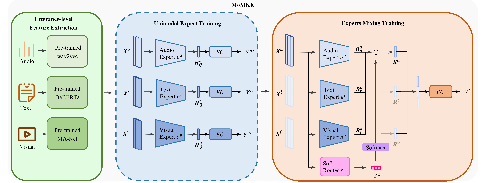

# MoMKE
Complete code for **"Leveraging Knowledge of Modality Experts for Incomplete Multimodal Learning"** accepted by *ACM Multimedia 2024* will be released soon！

Correspondence to: 
  - Wenxin Xu (wxxv@stu.xidian.edu.cn)
  - Hexin Jiang (hxjiang@stu.xidian.edu.cn)
  - Xuefeng Liang (xliang@xidian.edu.cn)

## Paper



[**Leveraging Knowledge of Modality Experts for Incomplete Multimodal Learning**](https://openreview.net/forum?id=Gt3a8A1wLg&referrer=%5BAuthor%20Console%5D(%2Fgroup%3Fid%3Dacmmm.org%2FACMMM%2F2024%2FConference%2FAuthors%23your-submissions))<br>
Wenxin Xu, Hexin Jiang, Xuefeng Liang<br>
ACM Multimedia, 2024, 🔥**Best Paper Nomination!**

```tex
@inproceedings{xu2024leveraging,
  title={Leveraging Knowledge of Modality Experts for Incomplete Multimodal Learning},
  author={Xu, Wenxin and Jiang, Hexin and others},
  booktitle={ACM Multimedia 2024},
  year={2024}
}
```

## Usage (Choose IEMOCAP-Six for Example)

### Prerequisites
- Python 3.8
- CUDA 11.6
- pytorch ==1.12.0
- torchvision == 0.13.0
- numpy == 1.24.3

(see requirements.txt for more details)

### Run MoMKE

~~~~shell
cd MoMKE
sh run_MoMKE_cmumosi.sh

sh run_MoMKE_cmumosei.sh

sh run_MoMKE_iemocap4.sh
~~~~

## Dataset

To ensure consistency with previous work, we followed the feature preprocessing module in [GCNet](https://github.com/zeroQiaoba/GCNet).

For your convenience, we list the feature links below they provide.

|  Dataset  |                          Task                          |                        Download link                         |
| :-------: | :----------------------------------------------------------: | :----------------------------------------------------------: |
|  IEMOCAP  |         Emotion Recognition       | [link](https://drive.google.com/file/d/1Hn82-ZD0CNqXQtImd982YHHi-3gIX2G3/view?usp=share_link)|
|  CMU-MOSI |          Sentiment Analysis        | [link](https://drive.google.com/file/d/1aJxArYfZsA-uLC0sOwIkjl_0ZWxiyPxj/view?usp=share_link)|
|  CMU-MOSEI|          Sentiment Analysis       | [link](https://drive.google.com/file/d/1L6oDbtpFW2C4MwL5TQsEflY1WHjtv7L5/view?usp=share_link)|

## Acknowledgement

This work was supported by the research funding of GuangZhou DaYou Network Technology Co., Ltd.
